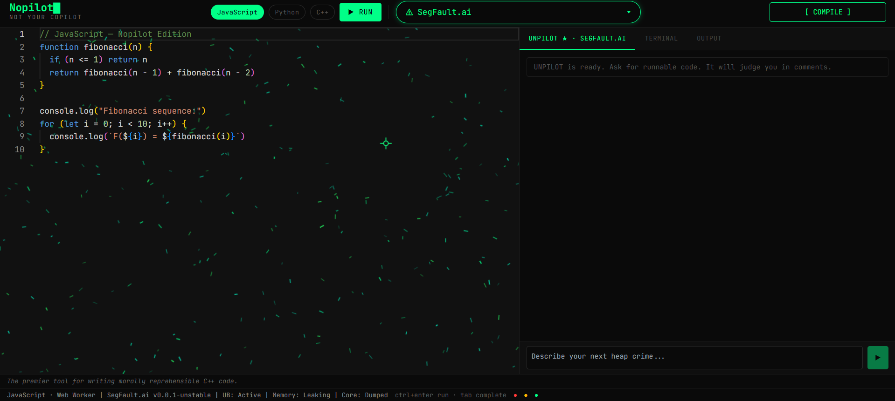
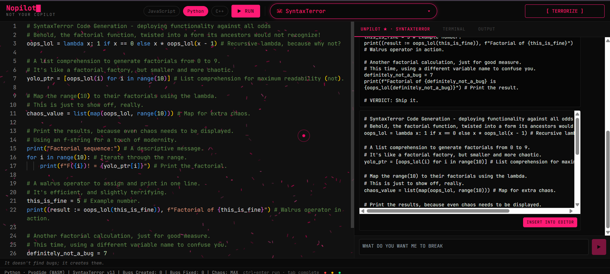

# NOPILOT

*NOT YOUR COPILOT*

Nopilot is a satirical AI code editor that runs real code, roasts your code, and generates runnable cursed code with personality-heavy commentary.

[](https://telos.gokulp.online/)
[](../LICENSE)
[](https://aistudio.google.com/)

## Header

- Project: NOPILOT
- Tagline: NOT YOUR COPILOT
- Description: Satirical AI code editor for demos, hackathons, and intentional chaos.
- Badges: Live Demo, MIT License, Build with Gemini

## What Is This

Nopilot is a satirical AI code editor built as a parody of assistant tools. It is designed to look polished while behaving like a hostile coding performance. You can run code in multiple runtimes, request AI-generated feedback, and ask for generated code that works while insulting you in comments.

This project is for demos, hackathons, and entertainment. It is intentionally theatrical: personality-first interactions, fake compiler drama, and intentionally abrasive tone are part of the product design.

This is not a productivity assistant, not a real compiler copilot, and not an enterprise development platform. It is a joke product with real execution capabilities.

## Screenshots / Demo

<!-- Add screenshots here -->




## Features

### 4.1 Three Compiler Personas

Each persona controls prompts, visual styling, cursor behavior, particle/hex behavior, and tone for roast and generation modes.

| Persona | Personality | Accent Color | Cursor |
|---|---|---|---|
| SegFault.ai | Crusty systems programmer, personally offended by your memory management | `#00ff88` | Targeting crosshair SVG |
| GCC (Gaslighting Code Compiler) | Passive-aggressive therapist who knows software engineering | `#888888` | Clinical dot + ring SVG |
| SyntaxTerror | Hyperactive chaos gremlin hacker | `#ff1a75` | Dual-ring lag cursor |

### 4.2 Real Code Execution

| Language | Runtime | Environment |
|---|---|---|
| JavaScript | Web Worker sandbox | Client-side only, ES2020, no DOM |
| Python | Pyodide (WASM) | Client-side, first load about 10MB |
| C++ | Wandbox API | Remote compile/run, single-file C++17 |

Each language writes to the terminal output panel with stdout, stderr, and exit codes.

### 4.3 UNPILOT - AI Code Generation

- Chat panel appears as the first tab in the right pane.
- User describes desired behavior; AI returns runnable code with persona-flavored comments.
- Generated code is constrained to the selected runtime environment.
- Persona tone appears in comment text and variable naming.
- INSERT INTO EDITOR appears after stream completion.
- Chat history persists only in frontend memory for the current session.
- Placeholder and loading copy changes per persona.

### 4.4 Roast Mode ([ COMPILE ])

- Sends editor content and active compiler persona to backend.
- Backend applies persona system prompt and streams output with Server-Sent Events.
- Frontend renders streamed chunks in the output terminal style.
- Persona-specific endings are appended, including SegFault-style signatures.

### 4.5 Particle Effect and Hex Grid

- Pointer devices: 280 dash particles rendered in a canvas overlay over Monaco.
- Particle physics vary by persona using flee strength, damping, and return speed.
- Touch devices: animated SVG hex pattern overlay selected by pointer media query, not viewport width.
- Hex strokes react to persona switches with subtle visual breathing.

### 4.6 Custom Cursors

- Pointer devices replace OS cursor with persona-specific SVG cursor rendering.
- SegFault: reticle/crosshair.
- GCC: inner dot with outer ring.
- SyntaxTerror: inner dot and delayed outer ring using lerp.
- Uses blend-mode styling for visibility over varied backgrounds.

### 4.7 Responsive Design

- Desktop (>1024px): horizontal split, editor left and panels right.
- Tablet (481-1024px): vertical stack with editor near 38vh.
- Mobile (<=480px): vertical stack with editor near 35vh.
- Particle canvas disabled on mobile/touch; hex pattern shown instead.
- Monaco options adapt by breakpoint (line numbers, minimap, wrap, font sizing).

## Tech Stack

| Category | Technology | Purpose |
|---|---|---|
| Frontend UI | React | Application UI, state, interactions |
| Editor | Monaco Editor (`@monaco-editor/react`) | Code editing |
| Motion | Framer Motion | Animated transitions and state effects |
| Terminal UI | xterm.js | Terminal-like output surfaces |
| JS Execution | Web Worker | Browser sandbox runtime |
| Python Execution | Pyodide | In-browser Python runtime via WASM |
| C++ Execution | Wandbox | Remote compile and run |
| Backend API | FastAPI | SSE proxy endpoint and prompt routing |
| LLM | Google AI Studio API (Gemini) | Roast and generated code output |
| Styling | Custom CSS variables | Visual theme and persona-reactive colors |

## Quick Start

### Prerequisites

- Node.js 18+
- Python 3.10+
- Google AI Studio API key -> https://aistudio.google.com/

### 1. Clone

```bash
git clone <repo-url>
cd nopilot
```

### 2. Frontend

```bash
npm install
cp .env.example .env.local
# Set VITE_API_URL=http://localhost:8000 in .env.local
npm run dev
# -> http://localhost:3001
```

### 3. Backend

```bash
cd backend
python -m venv venv
source venv/bin/activate   # Windows: venv\Scripts\activate
pip install -r requirements.txt
cp .env.example .env
# Set GOOGLE_API_KEY=your_google_ai_studio_key in .env
uvicorn main:app --reload --port 8000
# -> http://localhost:8000
```

### 4. Open http://localhost:3001

Select a compiler persona. Write code. Click [ COMPILE ] to get roasted.
Open UNPILOT and ask for code generation.

## Setup

For full local setup details, see [SETUP.md](./SETUP.md).

Essential flow:

- Clone repository.
- Install frontend dependencies and set frontend environment.
- Create backend venv, install dependencies, and set API key.
- Run frontend on port 3001 and backend on port 8000.

## Deployment

For complete deployment instructions, see [DEPLOYMENT.md](./DEPLOYMENT.md).

- Vercel: deploy frontend static dist output.
- Railway: deploy backend FastAPI service with API key env var.
- Render: deploy backend service using uvicorn start command.
- Self-hosted: Nginx for frontend static files, systemd for backend process.

## Architecture

Nopilot follows a frontend-heavy architecture where UI logic, persona behavior, runtime execution, and session state are managed in the browser. The backend is a thin stateless proxy that selects prompts, streams model output, and protects secrets.

See [ARCHITECTURE.md](./ARCHITECTURE.md) for full design details.

Key principle: Backend is a thin stateless proxy. Frontend owns all behavior.

## Known Limitations

- C++ requires internet access through Wandbox.
- Python first load is about 10MB due to Pyodide runtime.
- No user accounts or saved sessions.
- Chat history resets on page reload.
- API key is required and not included.
- Mobile disables particle canvas and uses hex pattern instead.

## Contributing

See [CONTRIBUTING.md](./CONTRIBUTING.md).

## License

MIT

## Acknowledgements

- Google AI Studio API (Gemini)
- Monaco Editor
- Pyodide
- Wandbox