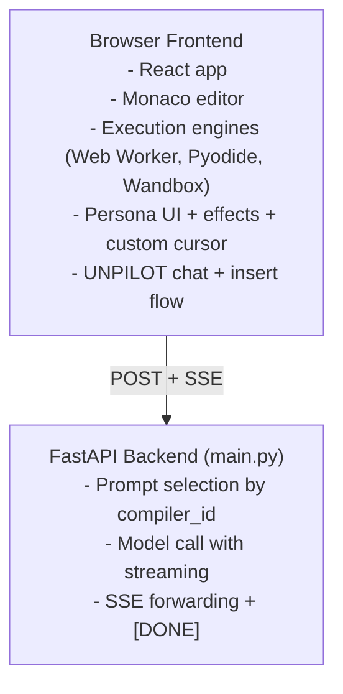
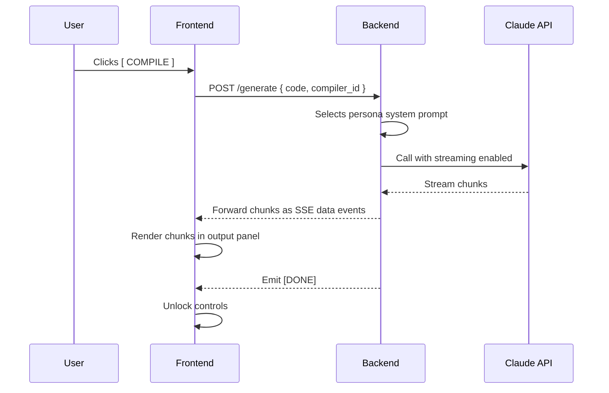
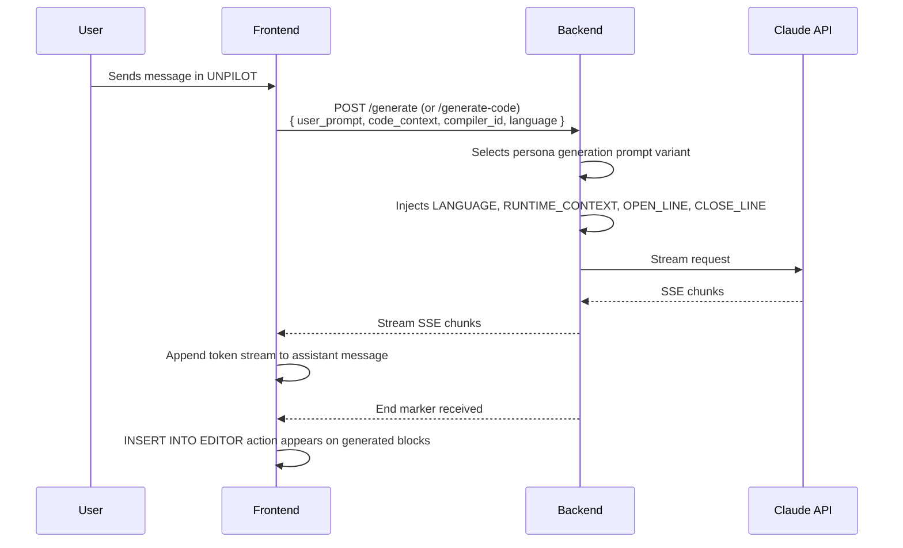

# Nopilot Architecture

## Core Principle

Backend is intentionally minimal and stateless.

- Frontend owns persona behavior, execution runtimes, UI state, and effects.
- Backend protects secrets, applies prompt templates, and forwards streaming model output.

In short: frontend is the product, backend is a thin transport and key boundary.

## High-Level System

## Request Flow: Roast Mode

## Request Flow: UNPILOT Generation

## Frontend Component Map

- Application shell and layout
  - App orchestrates mode, selected persona/language, and panel state.
  - Responsive split/stack layout selected by breakpoints.
- Editor pipeline
  - Monaco editor as core text surface.
  - Particle canvas overlay for pointer devices.
  - SVG hex overlay for touch/coarse pointer devices.
  - Persona-reactive custom cursor for fine pointers.
- Execution pipeline
  - JavaScript: Web Worker sandbox.
  - Python: Pyodide worker in browser.
  - C++: Wandbox API submission and stream parsing.
  - Output shown in terminal panel with persona formatting.
- AI pipeline
  - Roast stream from backend rendered into output panel.
  - UNPILOT chat stream rendered token by token.
  - Insert action appends generated code into editor buffer.
- Shared UX
  - Status bar with language/runtime/persona status cues.
  - Persona theming through CSS variables.

## Persona Runtime Model

Each persona contributes:

- Prompt templates for roast and generation modes.
- Accent color and text treatments.
- Cursor variant behavior.
- Particle color palette and physics profile.
- Status bar and output flavoring.

## Backend Scope

Strict backend responsibilities:

- Accept request payload.
- Select system prompt from compiler id.
- Call model API.
- Stream response as SSE chunks.
- Emit explicit [DONE] completion marker.

Implementation notes:

- Backend is a single file service: main.py.
- No persistent state, no workflow orchestration layer.

## Backend Non-Goals

- Does not compile or run user code.
- Does not store conversation history.
- Does not manage authentication or accounts.
- Does not provide analytics pipelines.
- Does not orchestrate multi-step agent workflows.

## Data and State Boundaries

- Frontend state
  - Current code, selected language/persona, chat history, panel state.
  - Execution results and transient stream buffers.
- Backend state
  - Per-request transient prompt/message processing only.
  - No database or server-side session memory.

## Streaming Contract

- Transport: text/event-stream.
- Event body lines use data: prefix.
- Terminal roast mode streams plain text lines.
- UNPILOT generation streams chunk text payloads and ends with [DONE].

## Failure Model

- Frontend handles stream startup failures and render-time stream errors.
- Backend surfaces model/stream exceptions as stream error messages where possible.
- C++ execution path can fail on network connectivity or remote compiler availability.

## Security and Secret Handling

- Model API key remains backend-only environment variable.
- Frontend receives only streamed text output, not provider credentials.
- CORS restricts allowed frontend origins.

## Why This Shape

This architecture keeps the parody-heavy product logic in one place (frontend), while keeping secret material and model provider calls server-side. It minimizes backend complexity and keeps iteration speed high for demo and hackathon workflows.